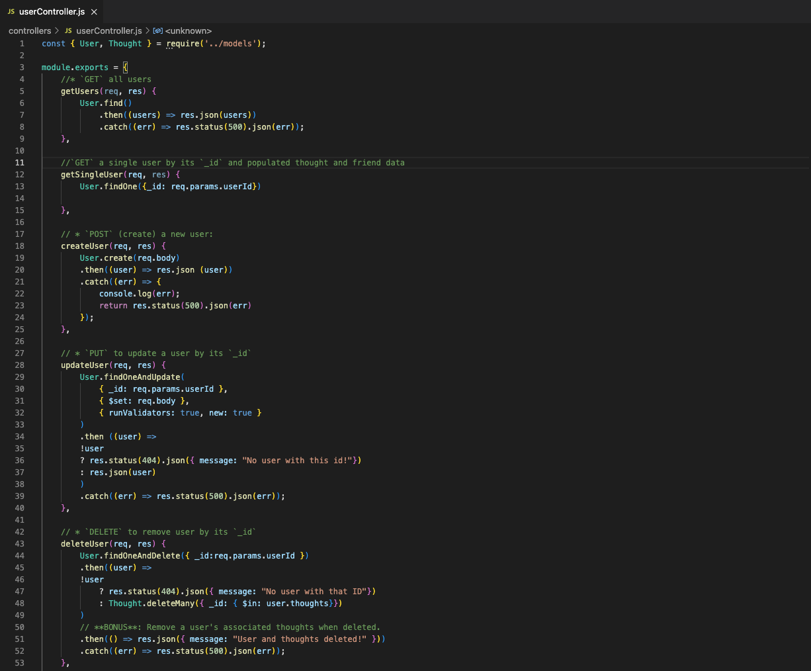

# nosql-social-network-api


## Description

Almost everyone uses at least one form of social media. As a result, it's important as a developer to know and understand the technologies that many social platforms use. I've created a social networking API, that allows its' users to add (or remove) friends &#128527;, share thoughts and reactions. The best part is, if anyone overshares or overreacts, as many do on social media, they can delete their thought &#128173; and reaction! To find out how I was able to create this api, please watch my [walkthrough video](https://app.castify.com/view/c1045bdd-eea7-4063-902e-1706c56a6e77)!

<!-- (https://app.castify.com/view/b1a74d0e-7156-4733-8925-626cf32472ae)!  -->


----
## Table of Contents 

  * [Installation](#installation)
  * [Usage](#usage)
  * [License](#license)
  * [Contribution](#contribution)
  * [Tests](#tests)
  * [Technologies](#technologies)
  * [Questions](#questions)

---
## Installation

After setting up my repo, the first action item I tackled was creating the file structure. I knew I needed a 'connection file' that created a connection to Mongoose and my 'socialNetworkDB', models, routes and last but not least, a server. Once that was complete, I moved on to installing two npm packages- [Express](https://www.npmjs.com/package/express) and [Mongoose](https://www.npmjs.com/package/mongoose). To install the packages, I typed the following into the command line:
```
 npm i express --save; npm i mongoose
 ```


---

## Usage

Once the server and the connection file were created, I began to create my models.

 <strong>User Model</strong>

 This model was created to store information about the user. Information like a username, email address, thoughts and friends. To create the username and email address I used a regex that would only allow names and emails that fit the criteria. For the username, I used the regex:

 ```
 /[A-Za-z0-9\- ]+/
 ```
 This regex means that any letter (uppercase or lowercase can be used, can contain numbers 0-9, can include a hyphen, has one or more instances). For more information about regex- please feel free to visit my [regex gist](https://gist.github.com/AmyLipscomb).

 I also created a 'friends' array that self-referenced the User Model, and a 'thoughts' array that referenced the Thought Model. I then created a virtual, that would allow the retrieval of one's friend count. 

 <strong>Thought Model</strong>

This model was created to store information about the the thought and the user who created it. Within this model, I created a 'reactions' array that connected to the 'reactionSchema'. I then created a virtual, that would allow the retrieval of one's reaction count. 

 <strong>Index Model</strong>

 This model's purpose was created to bridge the gap between the User and Thought model. 

--

 After the models were created, I created two controllers - one for User and one for Thought. Within the controllers, I created HTTP requests. Take a look at my code! 

 <strong>User Controller Code</strong>

 
 

  <strong>Thought Controller Code</strong>

  
  


Then I created the API routes, and tested them in Insomnia! 

---

## Contribution

  None.

  ---

## License

```
This project is licensed under MIT.
```

---


## Tests

None.

 ---

 ## Technologies

* JavaScript
* MongoDB
* Node.js
    * npm packages:
       * [express](https://www.npmjs.com/package/express)  
       * [mongoose](https://www.npmjs.com/package/mongoose)  
* Insomnia
* Screencatisfy
* VS Code

 ---

## Questions

If you'd like to see more of my projects, check out my github: [amylipscomb](https://github.com/amylipscomb).
For further information please contact me at [amy.a.lipscomb@gmail.com](mailto:amy.a.lipscomb@gmail.com)!
